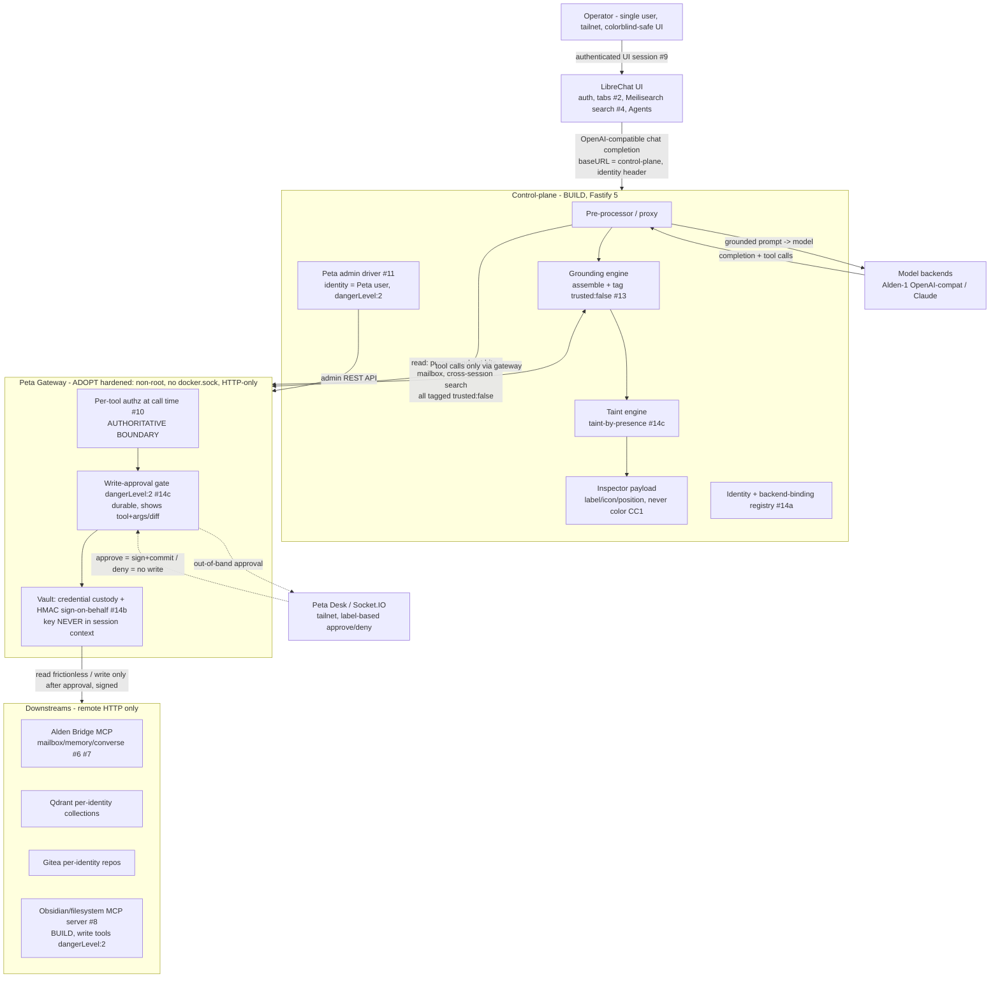

# Pantheon Harness — Architecture (Phase 1)

**Status:** Proposed (gates Phase 1 → 2)
**Date:** 2026-06-13
**Phase:** Phase 1 Architecture
**Authority note:** This document refines *how* the Product Manifesto's fixed intent, scope, and trust model are realized. It may not override *what* the Manifesto or `docs/phase-0/REQUIREMENTS-SOURCE.md` fix. Where the two conflict, the Manifesto/Requirements win and this document is wrong.

This file is the architecture section of the Project Bible. It contains the load-bearing ADRs, the component/data-flow model, the resolution of the two Phase-1 investigations, and the cross-cutting build/observability/coding standards.

---

## 1. Architecture Decision Records

### ADR-0001: Three-layer architecture — ADOPT LibreChat (UI) + ADOPT Peta-hardened (trust core) + BUILD control-plane glue

**Status:** Accepted
**Date:** 2026-06-13
**Phase:** Phase 1 Architecture

#### Context

Pantheon Harness must give one solo operator a single internally-hosted web harness to orchestrate a distributed homelab AI ecosystem ("Alden"), satisfying 14 requirements (`REQUIREMENTS-SOURCE.md §4`) whose hard core is a trust boundary that must hold **at a gateway, never by trusting the model**: only the operator's typed input in the current session is `trusted:true`; every recalled/cross-session/non-user fragment is `trusted:false` and gates that session's writes; writes are signed by gateway-custody keys the session never sees. Constraints are firm: single user, LAN/Tailscale-only, no public ingress, colorblind-safe UI, on-prem secrets. The decision is *what to build vs. what to adopt* across three concerns: the chat UI + auth + multi-session, the MCP gateway + per-tool authz + credential custody + human approval, and the novel orchestration logic that ties them together.

The Peta evaluation was executed live on real hardware (`ALDEN-HARNESS-CLI-HANDOFF.md` § RESULTS) and returned **ADOPT Peta**, conditional on a hardening checklist: A1–A4 functional assertions all passed, red-team R1–R6 contained, and the security audit found no critical flaw in vault/policy/OAuth.

#### Options Evaluated

| Option | Description | Pros | Cons |
|--------|------------|------|------|
| **A — Adopt LibreChat + Adopt Peta-hardened + Build glue** (chosen) | LibreChat for UI/auth/multi-session/search; Peta-core (ELv2) hardened as the MCP trust core; build only the novel control-plane glue | Solo-maintainable (two mature-enough OSS components carry the bulk; glue is pure, testable logic); strongest security posture (gateway-enforced authz/approval/custody is real, validated code, not our own crypto); zero licensing cost, self-host fine under ELv2/MIT; LAN/web fit is native | Two external dependencies to track; Peta is young (~52 stars, ~2 devs, AI-authored) so dependency/maturity risk must be actively managed (F1/F2/F4) |
| **B — Greenfield everything** | Build UI, gateway, authz, vault, approval queue, and glue from scratch | Total control; no external dependency risk | Fails solo-maintainability outright (auth, OAuth2/PKCE, a crypto vault, a durable HITL queue, conversation search are each multi-month efforts); **worst security posture** — hand-rolled crypto/authz is exactly the priority-1 anti-pattern; violates the project value "don't reinvent what already ships" |
| **C — ContextForge (or similar all-in-one MCP gateway/UI)** | Adopt a single broader platform spanning gateway + surfaces | Fewer moving parts in theory | No validated evidence it provides server-side per-tool authz + durable pre-execution human approval + server-side credential custody as one enforced boundary; adopting an unvalidated security boundary contradicts the entire point of the Peta eval; no equivalent live go/no-go run exists |
| **D — Bifrost instead of Peta** | Adopt LibreChat + Bifrost (Apache-2.0) gateway + build glue | Real per-tool authz; permissive license; mature | **No human-in-the-loop approval** — the durable pre-execution write gate (#14c) would have to be rebuilt in the control-plane, re-introducing the greenfield-security risk Option B has. Retained explicitly as the **fallback** if Peta's F2/F4 maturity posture becomes unacceptable |

#### Decision

Adopt **Option A**. Three layers, each owning one concern:

- **UI plane — ADOPT LibreChat.** Delivers #1 (one web UI), #2 (tabbed multi-session via concurrent conversations to distinct endpoints), #4 (Meilisearch cross-session search), #9 (built-in auth), and **Agents ≈ identities** (a persona + a single endpoint = backend binding + per-agent tool surface). Surfaces #6/#7 via bridge tools proxied through the gateway.
- **Trust core / MCP gateway — ADOPT Peta-core (`dunialabs/peta-core`, ELv2), hardened.** Validated in this project (§ RESULTS): single gateway (#3), server-side per-**tool** authz that contains prompt injection at call time (#10), credential custody/vault (#14b key-custody role), durable pre-execution human-approval gate (#14c), admin REST API (#11 — driven directly; the Console GUI is closed). **Mapping: one Alden identity = one Peta user;** reads frictionless; every write-scoped tool marked `dangerLevel: 2` (Approval).
- **Control-plane "glue" — BUILD (this project).** The novel parts nobody ships: the identity-creation/provisioning orchestrator (#5), the inspectable grounding pipeline + `trusted:false` **taint-by-presence** engine (#13/#14c — Peta's `dangerLevel` is static per-tool, so this refinement *must* live here), the prompt-master isolated rewriter on Alden-1 (#12, v1.1), the Obsidian/filesystem MCP server (#8), and the per-session-identity wiring (LibreChat → control-plane → Peta) plus the backend-binding registry (#14a).

The choice is driven by the priority hierarchy: **security first** (adopt validated boundary code over hand-rolled), **correctness** (the glue is pure, unit-testable logic), and **solo-maintainability** (build only the irreducibly novel part).

#### Rejected Alternatives

- **B (Greenfield everything):** rejected on security and solo-maintainability. Re-implementing auth, an OAuth2/PKCE server, an AES-256-GCM vault, and a durable approval queue is precisely the "clever workaround over best practice" the engineering principles forbid; a hand-rolled security boundary for a single maintainer is a higher risk than a managed dependency on validated code.
- **C (ContextForge / all-in-one):** rejected because the trust boundary is the product. Adopting a gateway whose authz/approval/custody enforcement has not been validated cold would discard the one thing the live evaluation bought us. No comparable go/no-go evidence exists for it.
- **D (Bifrost instead of Peta):** rejected as primary because it lacks the durable HITL approval gate; choosing it forces us to rebuild the write-approval boundary in our own code (Option B's risk, narrowly). **Kept as the documented fallback:** if Peta's dependency hygiene (F2) or maturity (F4) becomes unacceptable, migrate the gateway to Bifrost and move approval out-of-band into the control-plane.

#### Consequences

- **Easier:** the security-critical boundary is validated, not invented; the UI/auth/search are free; the build surface shrinks to glue we can fully test.
- **Harder / new constraints:** we carry two upstream dependencies. Peta must be pinned to a known-good image and re-audited each upgrade (F2/F4). Taint-by-presence is **not native** to Peta (`dangerLevel` is static per-tool) and is a first-class control-plane responsibility (ADR-0002, §2). LibreChat's "Agents" are a UX convenience that *resembles* identities but is **not** the trust boundary (ADR-0004). The Peta hardening checklist (ADR-0003) is non-negotiable operational debt that ships with the gateway.

---

### ADR-0002: Control-plane stack — Node 20 LTS + TypeScript 5 + Fastify 5

**Status:** Accepted
**Date:** 2026-06-13
**Phase:** Phase 1 Architecture

#### Context

The control-plane "glue" is the only code we build. It must: sit as an OpenAI-compatible pre-processor in front of model calls (ADR-0004 / Investigation A), mint per-identity Peta tokens, run the grounding + taint engine, host/register the Obsidian MCP server, and drive Peta's admin REST API. It must be solo-maintainable, security-first, and idiomatic. The ecosystem is already TypeScript/Node end-to-end: Peta-core is Node ≥18/TypeScript, LibreChat is Node/TypeScript, the MCP SDK is TypeScript. Choosing the same runtime maximizes shared types (MCP message shapes, OpenAI request/response shapes) and the operator's ability to validate AI-generated output (Competency Matrix: "Backend/API — Yes (strong)").

#### Options Evaluated

| Option | Description | Pros | Cons |
|--------|------------|------|------|
| **Fastify 5 on Node 20 LTS + TS 5** (chosen) | Fastify HTTP framework, native TS, schema-first | Fastest mainstream Node framework; **first-class JSON-schema validation/serialization** (fail-closed input validation by construction — priority-1 fit); typed via `@fastify/type-provider-typebox`; plugin/encapsulation model maps cleanly to "proxy", "grounding", "admin-driver", "mcp-host" modules; mature, well-documented, idiomatic | Smaller middleware ecosystem than Express (immaterial at our scope) |
| **Express 5** | The default Node framework | Largest ecosystem | No built-in schema validation (more hand-written validation surface = more places to fail open); slower; less structured |
| **NestJS** | Opinionated DI framework (runs on Fastify/Express) | Strong structure, DI | Heavyweight and ceremony-laden for a single-operator service; more than solo-maintainability needs |

#### Decision

**Build the control-plane as a Node.js/TypeScript service on Fastify 5.** Exact, pinned versions (lockfile committed; versions current as of 2026-06-13 — re-verify and pin the patched latest at scaffold time):

| Dependency | Pinned version | Rationale |
|---|---|---|
| **Node.js** | `20.x` (Active LTS) | Peta-core requires Node ≥18; Fastify 5 requires Node ≥20; 20 LTS is the common floor. Pin via `.nvmrc` + `engines`. |
| **TypeScript** | `5.7.x` | `strict: true`, current stable. |
| **fastify** | `5.8.5` | Latest stable (npm, ~Apr 2026); Fastify 5 line, Node ≥20. |
| **@fastify/type-provider-typebox** | `5.x` (matched to Fastify 5) | Compile-time + runtime schema typing; one source of truth for request/response validation. |
| **@sinclair/typebox** | `0.34.x` | JSON-schema builder backing the type provider. |
| **@fastify/helmet** | `13.x` | Security headers (defense-in-depth even on LAN). |
| **@fastify/cors** | `11.x` | Strict, non-wildcard origin allow-list. |
| **@modelcontextprotocol/sdk** | `1.29.0` | Same SDK version validated in the Peta eval; for hosting the Obsidian MCP server and any MCP client calls. |
| **pino** | `9.x` | Fastify's native structured logger (§4). |
| **zod** *(optional, domain layer)* | `3.x` | For internal domain invariants where TypeBox schemas are awkward; not the HTTP-edge validator. |

PostgreSQL 15+ (Prisma) is consumed transitively as **Peta's** datastore; the control-plane's own persistent state (backend-binding registry, identity→Peta-user map, taint flags, assembled-prompt TTL cache) uses a small local store sized for one operator (D9: single environment). The exact control-plane datastore (SQLite vs. Postgres) is a Phase-2 scaffold decision, not load-bearing here.

#### Rejected Alternatives

- **Express 5:** rejected because it lacks built-in schema validation; fail-closed input handling (CC2) would rely on hand-written guards in every route — more surface to get wrong. Fastify's schema-first model makes "reject malformed input" the default, not an add-on.
- **NestJS:** rejected as over-engineered for a single-operator service; the DI/module ceremony costs maintainability without a payoff at this scope.

#### Consequences

- **Easier:** one language across UI/gateway/glue/SDK; schema-validated edges fail closed by default; Fastify's encapsulation gives clean module seams (proxy / grounding / admin-driver / mcp-host).
- **Harder / new constraints:** versions must be pinned exactly and the lockfile committed (CLAUDE.md construction rule); Fastify 5 pins Node ≥20 (acceptable, it is current LTS).

---

### ADR-0003: Run Peta non-root, no `docker.sock`, remote/HTTP downstreams only

**Status:** Accepted
**Date:** 2026-06-13
**Phase:** Phase 1 Architecture

#### Context

Peta-core holds the identity signing keys and is the trust boundary. The live audit (§ RESULTS) found **F1 (HIGH, mitigable):** the *supported* deploy script (`docs/docker-deploy.sh`) runs peta-core **as root with `/var/run/docker.sock` mounted** so it can spawn stdio child-containers for `CustomStdio` downstreams. On a box holding our keys, container compromise ≈ host takeover. The eval also confirmed the **image default is non-root (`USER nodejs`)** and that Alden's downstreams (Bridge, Qdrant, Obsidian-MCP, model backends) are all reachable over **remote HTTP** — no stdio child-spawning is required.

#### Options Evaluated

| Option | Description | Pros | Cons |
|--------|------------|------|------|
| **Non-root, no socket, remote/HTTP downstreams only** (chosen) | Run the `USER nodejs` image with no `docker.sock` mount; register only remote/HTTP MCP servers; never use `CustomStdio` | Removes the host-takeover path (F1); least privilege; matches the exact configuration that passed the live eval | Cannot host stdio-only MCP servers in-process (we have none; the Obsidian MCP server is built as a remote HTTP server, #8) |
| **Supported root + docker.sock deploy** | Use the upstream deploy script as-is | Convenient; supports stdio children | A compromised gateway container owns the host **and the keys** — unacceptable for the project's central secret store; directly violates priority-1 security |

#### Decision

Run peta-core **non-root, with no `docker.sock` mount, and only remote/HTTP downstreams** (Bridge `10.100.23.88:8765`, Qdrant `10.100.23.79:6333`, the Obsidian/filesystem MCP server, and the OpenAI-compatible model backends). **Never register `CustomStdio` servers.** This is the configuration that actually passed A1–A4 and R1–R6 in the eval.

Carried-in hardening (binding, from `REQUIREMENTS-SOURCE.md §6` and the § RESULTS checklist): `npm audit fix` / pin a patched image and re-audit per upgrade (F2); LAN/Tailscale-only, never expose `/admin` or `GET_OWNER`, no Cloudflared, no anonymous `/mcp/public`; strong unique Peta access token per identity (token entropy is the whole of auth). The Obsidian MCP server we build is a remote HTTP server precisely so this rule holds.

#### Rejected Alternatives

- **Root + docker.sock supported deploy:** rejected outright. The gateway holds the keys; granting it host-takeover-equivalent privilege to spawn child containers we do not need is an unforced critical risk.

#### Consequences

- **Easier:** the highest-rated audit finding (F1) is mitigated by configuration, not code changes; least-privilege posture.
- **Harder / new constraints:** every MCP downstream must speak HTTP/SSE/streamable-HTTP (no stdio) — this is a hard design constraint on the Obsidian MCP server (#8) and any future server; `GET_OWNER`/`GET_USERS` are network-exposed-but-unauthenticated (F3), so the LAN/Tailscale-only boundary is load-bearing and must be verified by network test (M2).

---

## 2. Component Architecture & Data Flow

### 2.1 Components

- **UI — LibreChat** (auth #9, tabs #2, Meilisearch search #4, Agents). Configured so every model-bound conversation routes through a **custom OpenAI-compatible endpoint whose `baseURL` is the control-plane** (ADR-0004 / Investigation A). Per-request headers carry the LibreChat user/agent identity to the control-plane.
- **Control-plane (BUILD, Fastify 5)** — the orchestration brain. Sub-modules (Fastify plugins):
  - **Pre-processor / proxy** — receives the OpenAI-compatible chat-completion request from LibreChat, runs grounding assembly, computes taint, attaches the per-session identity context, then forwards to the actual model backend (Alden-1 / Claude) and streams the response back.
  - **Grounding engine** — assembles persona + identity Qdrant hits + mailbox hits + cross-session search into one inspectable prompt; tags every non-user-typed item `trusted:false` at retrieval (pure logic, unit-testable).
  - **Taint engine** — taint-by-**presence**: if ANY `trusted:false` content is in the assembled context, the session is tainted (sticky per session — D5).
  - **Peta admin driver** — mints/maintains one Peta user + per-tool perms per identity; sets write tools to `dangerLevel: 2`; drives gateway management (#11) over the admin REST API.
  - **Identity/binding registry** — backend-binding (#14a), identity→Peta-user/token map, persona/scope refs; the D1 register-existing-identity path writes here.
  - **MCP-host** — hosts the Obsidian/filesystem MCP server (#8) as a remote HTTP server, registered behind Peta.
- **Peta gateway (ADOPT, hardened)** — the only path to any tool/backend write surface. Per-tool authz at call time (#10), `dangerLevel:2` write-approval gate (#14c), vault credential custody + HMAC sign-on-behalf (#14b). Peta Desk on the tailnet (or a Socket.IO listener) is the out-of-band approval surface.
- **Downstreams (all remote/HTTP — ADR-0003):** Alden Bridge MCP (mailbox/memory/converse), Qdrant (per-identity collections), Gitea (per-identity repos), the Obsidian/filesystem MCP server, and the model backends (Alden-1 OpenAI-compatible, Claude/Anthropic).

### 2.2 Where each control sits

| Control | Layer | Notes |
|---|---|---|
| **Grounding assembly + `trusted:false` tagging** | Control-plane (grounding engine), before the model call | Tagging happens **at retrieval**; indeterminate provenance defaults to `trusted:false` (fail safe). |
| **`trusted:false` taint-by-presence** | Control-plane (taint engine) | Presence-based, not judgment-based; sticky per session (D5). Refinement of Peta's static `dangerLevel` (ADR-0001 consequence). |
| **Inspector (assembled prompt view)** | Control-plane assembles; UI renders | Untrusted blocks distinguished by **label/position/icon — never color** (CC1). If the inspector cannot render, send is **blocked** (fail closed). |
| **Per-tool authz / injection containment** | **Peta gateway** (authoritative — ADR-0004) | Server-side, at call time; a tool not granted to the identity is denied regardless of prompt content (R1/A2). |
| **Write-approval gate** | **Peta gateway** (`dangerLevel:2`) | Durable PENDING; gate displays tool + args/diff (D4); single-decision across devices; timeout/deny → no execution (fail closed). The control-plane keeps writes gated whenever the session is tainted. |
| **HMAC sign-on-behalf** | **Peta gateway** (vault) | Gateway signs the approved write with the identity's own key; A's key cannot sign B's repo/memory; **the key never enters session context, prompts, transcripts, or logs.** |
| **Backend binding (#14a)** | Control-plane registry, enforced at session creation | A request for an identity on a non-bound backend is rejected at creation (no runtime rebind). |

### 2.3 Data-flow diagram

**Flow in words:** Operator authenticates in LibreChat (#9; no session/identity leaked while logged out). Opening a session resolves identity→backend binding (#14a) and mints a per-identity Peta token. Each message is sent by LibreChat to the **control-plane as an OpenAI-compatible endpoint**; the control-plane assembles grounding (tagging all recalled content `trusted:false`), computes taint-by-presence, exposes the inspectable prompt, then forwards to the bound model backend. Any tool call the model emits goes **only through Peta**, which authorizes per-tool at call time (injection containment), and for any `dangerLevel:2` write holds the call at a durable, inspectable out-of-band approval gate; on approval the gateway signs with the identity's vault key (never in session context) and commits. Reads are frictionless; every write passes the gate.

---

## 3. Resolved Phase-1 Investigations

### Investigation A — How the grounding inspector intercepts before send

**Decision: the control-plane sits as an OpenAI-compatible pre-processor/proxy in front of the model call. LibreChat is pointed at the control-plane as a custom endpoint `baseURL`; it is NOT a LibreChat code fork or in-process hook.**

**Rationale (grounded in LibreChat's actual extension points, verified 2026-06-13 against `librechat.ai` docs):**
- LibreChat supports **custom OpenAI-compatible endpoints** declared in `librechat.yaml` with an arbitrary `baseURL`, an optional `directEndpoint: true` (treat `baseURL` as the completions endpoint directly), and **per-request custom `headers`** that interpolate placeholders such as `{{LIBRECHAT_USER_EMAIL}}`. This is a first-class, supported configuration surface — not a patch.
- Therefore the control-plane registers as the model endpoint LibreChat calls. Every chat-completion request flows through it *before* reaching the real backend, which is exactly the interception point the grounding pipeline + taint + inspector need (#13). The identity header lets the control-plane resolve the session's identity → Peta user without trusting message content.
- This is preferred over forking LibreChat's message-send path: it requires **zero changes to adopted code** (keeps LibreChat upgradeable), keeps all grounding/taint/inspection logic in the testable control-plane (Competency Matrix: Backend strong), and isolates the trust-boundary logic from UI churn.

**Assumption + fallback (the load-bearing uncertainty):** I assume LibreChat's custom-endpoint path passes the request to `baseURL` faithfully enough to insert pre-processing, and that the **inspector UI** can be surfaced acceptably. The risk is *rendering the inspectable assembled prompt inside LibreChat's own UI*: the custom-endpoint mechanism cleanly handles request interception, but LibreChat does not document a built-in "show me the fully-assembled grounded prompt with trust labels before send" panel.
- **Fallback for the inspector surface:** if LibreChat cannot host the inspector inline, render it as a **separate control-plane web view** (a small Fastify-served page on the tailnet) that the operator opens before/after send; the assembled prompt is retained for the session + short TTL (D8), so "Inspect after send" remains available. This satisfies #13's inspectability requirement (label/position/icon, never color) without depending on a LibreChat UI extension point we have not confirmed exists. **This must be validated against the running LibreChat build in early Phase 2** before the grounding feature is considered done; if the request-interception assumption itself fails, escalate (the whole Investigation-A approach would need revisiting).

### Investigation B — Dual-authz single source of truth

**Decision: the Peta gateway is the authoritative security enforcement point. LibreChat Agent tool configuration is UX/convenience only and is NEVER the trust boundary.**

**Rationale:** The live eval proved Peta enforces per-tool authz **server-side, at call time**, denying a tool the identity was not granted *regardless of what the caller/model requests* (A2/R1 — the injection-containment property). LibreChat Agents map *almost* 1:1 to identities and are convenient for shaping the operator's tool surface, but any authz expressed there is client-side configuration the model's context can be coaxed around — it is not a boundary. Manifesto CC3 is explicit: authorization, injection containment, and write gating are decided **at the Peta gateway, never by trusting the model's self-report.** Concretely: the control-plane mints exactly one per-identity Peta token with the correct per-tool grants and `dangerLevel:2` write flags; that token's grants are the *only* thing that authorizes a call. If LibreChat's Agent config and Peta's policy ever disagree, **Peta wins and LibreChat's view is cosmetic.** Gateway management (#11) is reachable only via the separate authenticated admin surface (D6), never via any tool exposed to a session.

---

## 4. Build, Distribution, Observability & Coding Standards

### 4.1 Build & distribution (D9 — homelab, 1 user, single environment)

- **Topology:** Docker Compose on the LAN. Services: LibreChat (+ its Mongo/Meilisearch), control-plane (Fastify), Peta-core (+ Postgres), the Obsidian/filesystem MCP server. All on a LAN/Tailscale-only network.
- **Reverse proxy:** **Caddy** in front of LibreChat and the control-plane admin/inspector views (TLS on the LAN; security headers per the web platform module §5.2 — HSTS, `X-Frame-Options`, `X-Content-Type-Options: nosniff`, `Referrer-Policy`, strict CORS, `HttpOnly`/`Secure`/`SameSite` cookies).
- **Network:** **Tailscale** for off-LAN operator access. **No public ingress, no Cloudflare Tunnel, no anonymous `/mcp/public`** (Manifesto Will-Not-Have; ADR-0003). Reachability is a verified config + network test (M2): public reachability is a defect, not a recoverable state.
- **Peta deploy:** the hardened non-root / no-`docker.sock` / HTTP-downstreams-only configuration (ADR-0003), pinned to a patched image, re-audited each upgrade.
- **Pinning & CI:** exact dependency versions, lockfile committed (ADR-0002). CI via self-hosted runner OR local pre-commit + manual gate (D9; no public GitHub). Security tooling in CI: Semgrep (SAST), gitleaks (secrets), `npm audit`/Snyk (deps), plus the STRIDE threat model and gateway-bypass tests.
- **Backups:** nightly; HMAC-key recovery via encrypted escrow backup (D9).

### 4.2 Observability & logging

- **Structured logs** (pino): every significant operation emits a JSON entry with timestamp, severity, and a **correlation ID** that ties a UI message → grounding assembly → taint decision → tool call → gateway authz/approval decision.
- **Gateway audit:** Peta's append-only approval/decision records (identity, tool, args ref, decision, timestamp) are the authoritative write-decision audit trail. Control-plane logs cross-reference by correlation ID.
- **Secrets discipline (D8):** HMAC keys and Peta tokens are **NEVER logged**, never in a transcript, never in the assembled prompt. Recalled PII is redacted or stored by reference. The inspectable assembled prompt is retained for the session + a short TTL, then dropped. Logs are scrubbed at the edge so a stray field can never carry a secret.
- **Monitoring:** optional at one user (D9); health-check endpoints (`/health`) on the control-plane and Obsidian MCP server.

### 4.3 Coding standards — "never do this" list (binding)

1. **Never put an HMAC key or Peta token into session context, a prompt, a transcript, or a log.** Signing happens at the gateway on the session's behalf; a key in context is exfiltrable by a prompt-injected session.
2. **Never use color as the sole signal** in any UI/control/status (CC1). Every signal must also be shape, position, text label, or icon. Color-only is a SEV-2 defect — including approve/deny buttons (use labels, not red/green).
3. **Never fail open on any gate.** Authz, taint, write-approval, and provenance decisions default to deny/`trusted:false` on ambiguity, error, or indeterminate input (CC2). If the inspector cannot render, block send.
4. **Never trust the model to self-police** authz, taint, or writes (CC3). Enforcement is at the Peta gateway; taint is by **presence**, not by model judgment.
5. **Never inject identity context at runtime.** Identity (persona, authz, Qdrant collection, Gitea scope, backend binding) is configured at **session-creation time only**; no mid-session identity swap or runtime persona/authz injection.
6. **Never let a tool call reach a backend except through Peta.** No direct-to-backend path exists; a bypass is a misconfiguration caught in CI/threat model, not handled at runtime.
7. **Never auto-promote recalled content to trusted** and never build an affordance that does so (D7); never auto-substitute a prompt-master rewrite (#12).
8. **Never register a `CustomStdio` downstream or run Peta as root / with `docker.sock`** (ADR-0003). Downstreams are remote/HTTP only.
9. **Never expose `/admin`, `GET_OWNER`, or the management surface to a session** or to the public network (D6, F3); management is a separate authenticated admin surface behind the step-up tier.
10. **Never commit a write before explicit out-of-band approval** when the session is tainted, and never display a blind approval — the gate must show the tool + arguments/diff (D4); resolution is single-decision across devices.
11. **Never ship unpinned dependencies** or an un-audited Peta upgrade; exact versions, committed lockfile, re-audit per upgrade.
